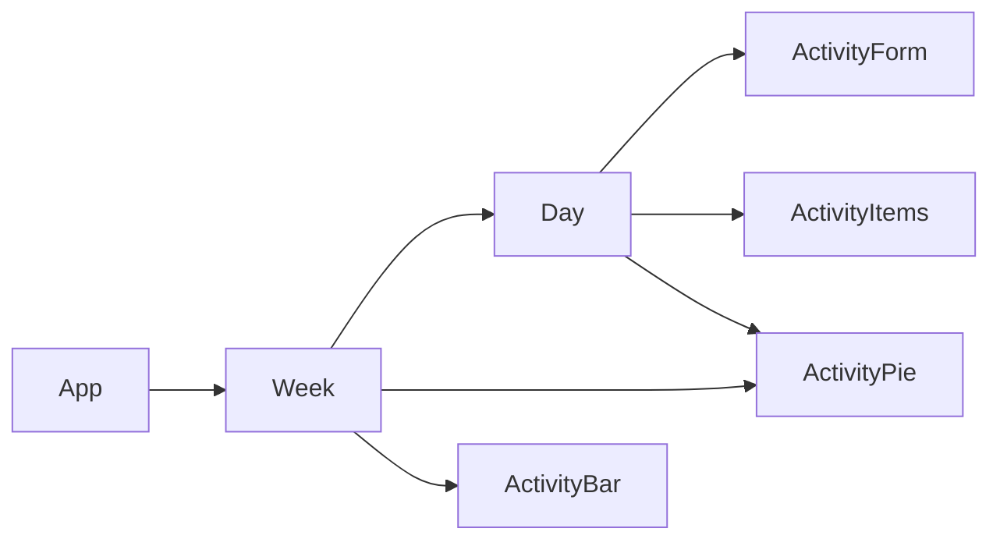

# TimeTrackr

Log how your time is spend each day and view the data in chart form.

## Dependencies

Requires NodeJS 14.x. Install using

```bash
npm install
```

## Running Instructions

Start the developement server using

```bash
npm start
```

## Design

### Components



### Database

usage (collection) > YYYY-MM-DD (document) > activity (collection) > HH-mm-ss

```js
{
    name: String,
    start: Timestamp,
    end: Timestamp
}
```


## Todo

- [x] Users can see their activity for a day as a list
- [x] Users cam enter their activity
    - [x] There is a form for users to enter activity
    - [x] After entering, the new entry is displayed immediately
- [x] Users can view their activity data for a *blank* as a pie chart
    - [x] Day
    - [x] Week
- [x] Users can delete activity
- [x] Users can export data as a CSV
- [x] Looks pretty
- [x] "Average" day breakdown
- [ ] User login
