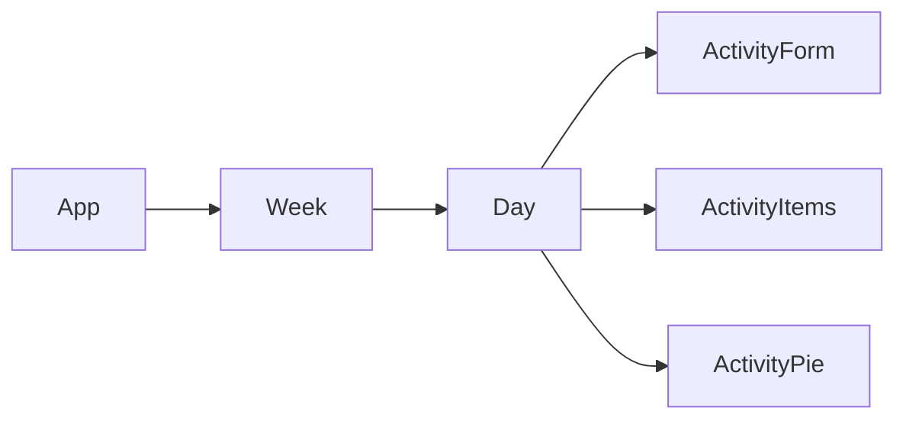

# TimeTrackr

- Day.js
- Firebase
- React
- Recharts

## Component Architecture



## Database Schema

usage (collection) > YYYY-MM-DD (document) > activity (collection) >

```
{
    name: String,
    start (id): Timestamp,
    end: Timestamp
}
```

## Todo

- [x] Users can see their activity for a day as a list
- [x] Users cam enter their activity
    - [x] There is a form for users to enter activity
    - [x] After entering, the new entry is displayed immediately
- [x] Users can view their activity data for a *blank* as a pie chart
    - [x] Day
    - [x] Week
- [x] Users can delete activity
- [x] Users can export data as a CSV
- [ ] Looks pretty
