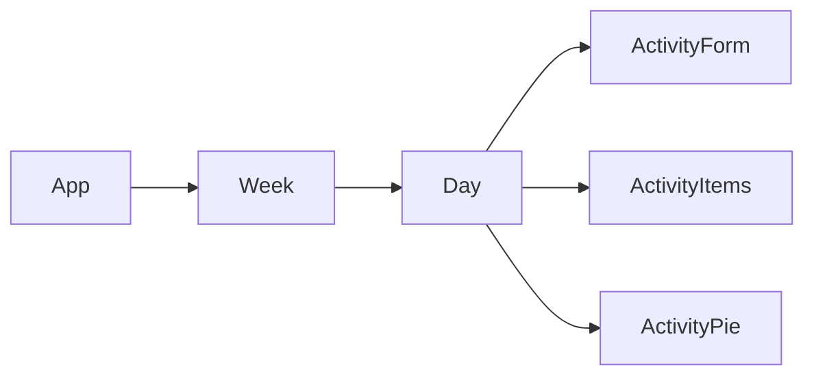

# TimeTrackr

- Day.js
- Firebase
- React
- Recharts

## Component Architecture

## Database Structure

## Todo

- [x] Users can see their activity for a day as a list
- [ ] Users cam enter their activity
    - [x] There is a form for users to enter activity
    - [ ] After entering, the new entry is displayed immediately
- [ ] Users can view their activity data for a *blank* as a pie chart
    - [x] Day
    - [ ] Week
- [ ] Users can edit entered activity
- [ ] Looks pretty
